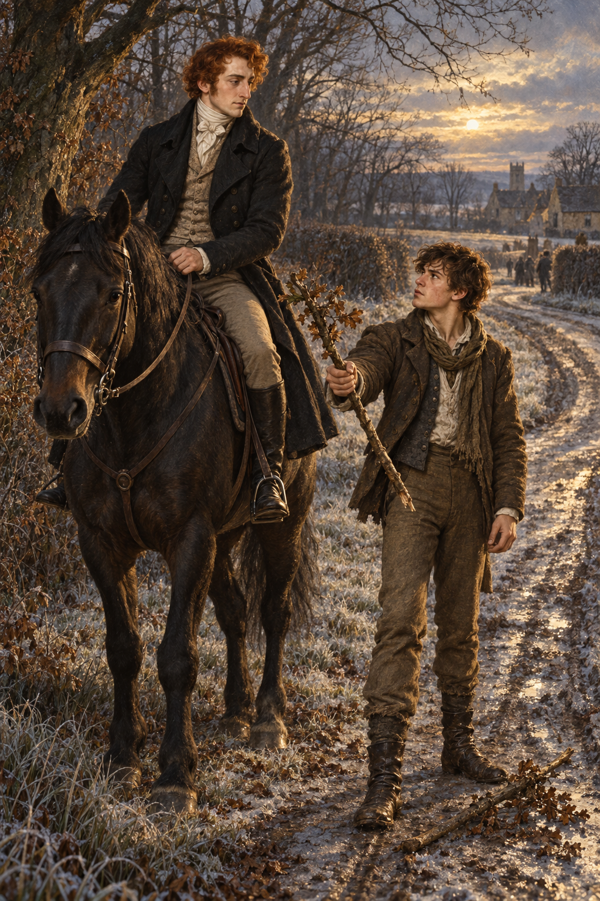

# 冬日村口的折返

喬納森和傑里米本來已離開 Monk Gretton。籬下有人睡著，村民帶著武器圍在附近；喬納森沒有停下，卻在路上想起阿拉貝拉。他試著想像自己如何對她說明這件事，才發現剛才的決定連自己都無法坦然接受，於是勒馬折返。

傑里米沒有長篇勸說。他像早已等著主人開口一樣下馬，撿起一根粗樹枝作防身的武器。畫面停在兩人重新面向村口的時候：寒光照著道路，陌生人與村民仍在遠處，誰也還不知道接下來會怎樣。

我想留下的是這個小小的轉向。喬納森想像中的阿拉貝拉未必等同真正的她，但他終究讓那份不安變成行動；傑里米的準備則讓善意有了實際的重量。與本章另一張鏡中書房的魔法奇景相比，這一刻沒有法術，卻更像喬納森故事真正開始的地方。

