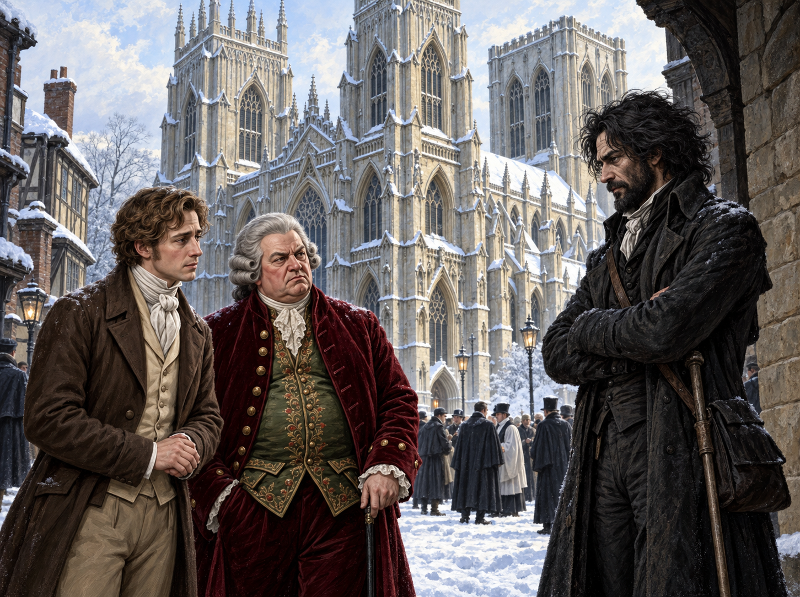

# 🖼️ 雪中大教堂前的等待

約克的學者們在古星酒棧裡爭論誰早已看穿諾瑞爾，卻仍得靠一場公開施法來確認自己的世界是否會被改寫。協議把這份焦慮變成代價：諾瑞爾若成功，協會便要解散；而塞貢杜斯排在最後，拒絕用簽名換取繼續被稱作魔法師的資格。

我把畫面停在雪中的約克大教堂，因為魔法尚未出現，權力卻已經先換了位置。福克斯卡斯爾穿著醒目的深紅天鵝絨，仍像一艘自信的黑船；塞貢杜斯站在灰藍冷光裡，知道自己缺乏書與證據，卻不肯把生命交給別人的條款。遠處的協會成員與教士安靜地朝南門廊移動，所有人都在等一個不在場的人。

奇德曼從側邊陰影裡現身，告知諾瑞爾不會親自來，施法會在何妨寺發生、卻在約克生效。他沒有施展任何奇術，僅憑代理人的語氣就重新安排了眾人的步伐。大雪抹去街道的泥濘與聲音，反而使這個守門人的黑色輪廓更清楚：真正被驗證之前，魔法已先成為一種遠距離支配。

