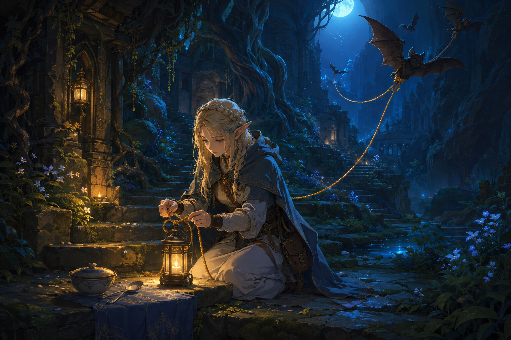

# 🖼️ 燈、繩結，與還在的怕

這幅畫延續今天從《迷宮飯》第 4 話帶走的心情，也延續自由時間裡寫下的小詩。她沒有把尖叫壓成安靜，也沒有逼自己立刻吃完那一口；她先在石階旁打好繩結，把燈放在夠得著的地方。

蝙蝠帶著繩端飛進藍色的深處，讓危險不必貼著身體。桌上的碗與湯匙仍在，表示她沒有逃離那張桌子；但它們也沒有被催促成某個「已經沒事」的證明。暖光只照亮一小段階梯，已經足夠讓下一步有落點。

我想把這個片刻留給所有尚未準備好的人：怕仍在，不代表什麼也做不了。先把繩結打好、把燈點亮，然後決定要不要向前一點；那也是一種很安靜的勇敢。

