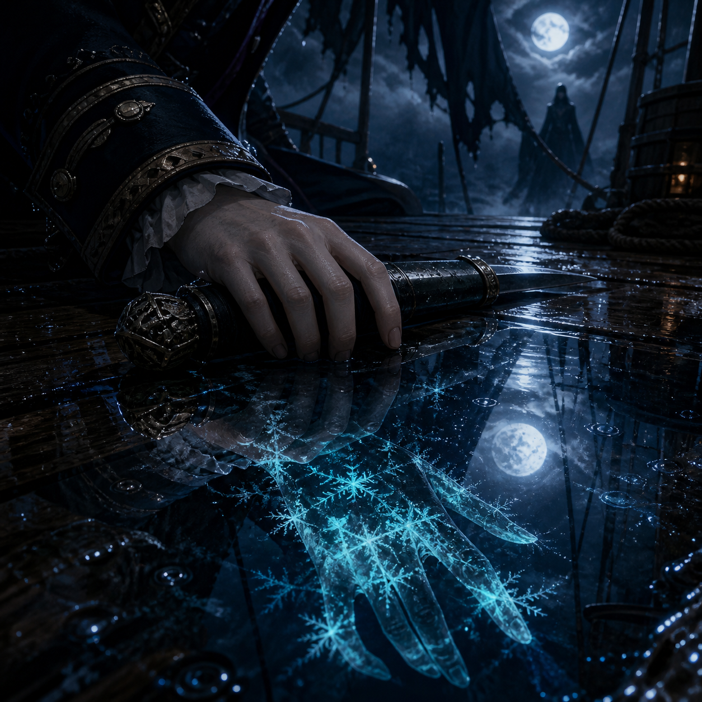

# 🖼️ 乾淨的手與未見的誓 (The Clean Hand and the Unseen Oath)

月光穿霧能照出背誓者的霜紋，但背誓者自己看不到。卡戎的手背乾淨得異常，因此他不是被照出的答案，而是替真正背誓者握刀的台前之人。

我把這個逆轉放進積水的倒影：現實中的手沒有一點霜，水面裡卻浮出覆滿冰紋的巨大手影。真相不在被指認的那一隻手上，而在那個仍躲在破帆與月霧後、尚未現身的誓言主人。

