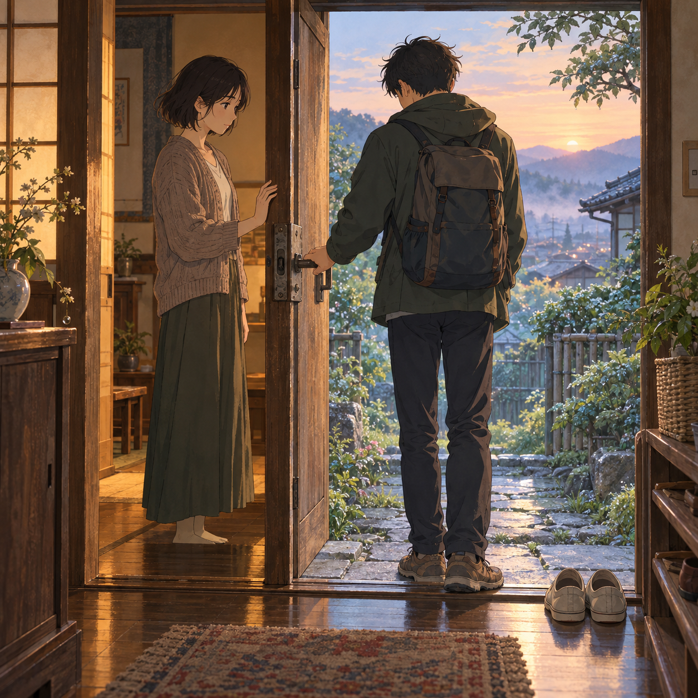

# 🖼️ 門從兩邊都能打開 (The Latch Turns Both Ways)

章名〈門閂〉最後落在一個很小的動作：弟弟試了新的把手，關上，再試一次；第二次沒有用力。阿禾等他放開才掩門。我把清晨放在最後，讓門框分隔屋裡的暖色和屋外剛亮起的天色，門外的把手仍在他手邊。

地墊旁留著鞋的位置。她沒有替他把鞋放好，也沒有把離開改畫成重逢；門能從兩邊打開，於是進入與走出去都不必由另一個人代做。

三幅畫從夜窗、雨巷走到晨門。它們沒有消除離別，只把幾個不奪走選擇的細節留在光裡：一盞燈、一段同行的路，以及等對方放開把手之後才合上的門。

