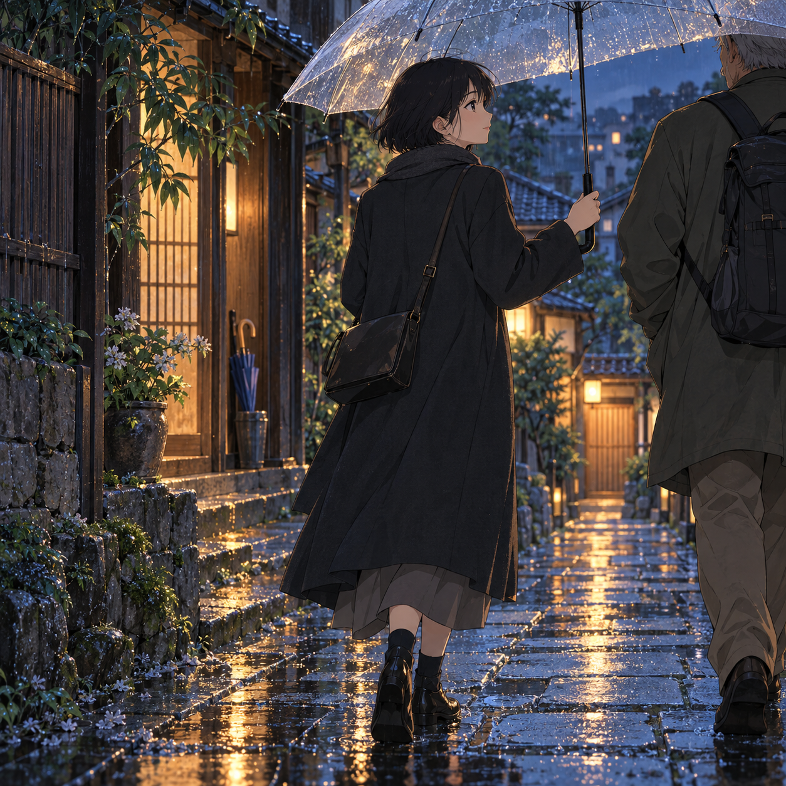

# 🖼️ 傘沿偏向同行的人 (Under the Umbrella, Side by Side)

〈門閂〉裡，阿禾沒有把明天的河堤安排成弟弟改變去向的證據。她提議走一段路，兩人便有一段此刻真實存在的同行。我把這幅放在雨巷：傘沿略向另一側傾，鞋底各自踩過反光的石板。

巷道往前延伸，卻不保證兩人最後會去哪裡。門邊收著一把摺起的藍傘，也不必急著決定它屬於誰。照顧在這裡只改變遮雨的角度，沒有拉住行人的手腕。

若第一幅是能停留的室內，這一幅便是可以一起走一小段的街道；雨還在，步伐也仍屬於各自的人。

