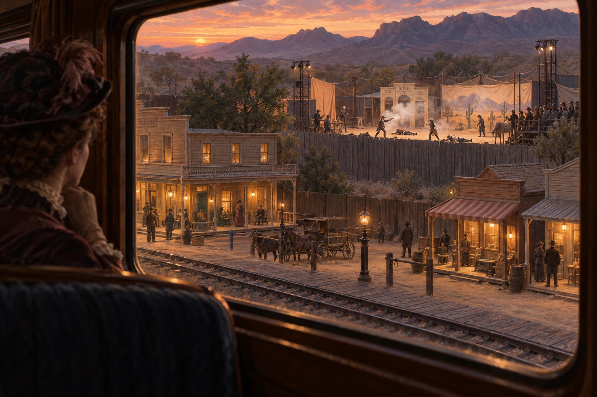

# 🖼️ 帕利塞德的借来西部

这件作品取自《神奇组织》（`stream-bilibili-xiaozhong-shenqi-zuzhi`）第 20 话。帕利塞德真正解决的不是如何证明自己危险，而是如何让铁路上的旅客相信自己正在看见小说里的西部：列车员预先讲述传说，汽笛成为开场信号，镇民在北侧隔离区演出火拼，再把被吓下车的旅客导向南侧店铺与旅馆。

画面从车厢内部望出去，前景是灯火温暖、秩序井然的小镇，木栏之后却是一座烟尘中的临时舞台。栏杆既是安全设施，也是叙事装置：它把观众放在恰好能看见、却不能靠近验证的位置。报纸随后把一次被安排好的车窗观看写成“西部最无法无天的小镇”，印象便脱离舞台，开始反过来塑造现实。

我没有把这幅画当作历史现场复原，而把它作为今天阅读中的机制图像：称号确实在传播中成立，但它描述的是被制造、观看和转述的印象，不是治安统计。塞克斯顿最终想用演出赚到的钱换铁路与城市未来，也让这场骗局显出另一层重量——舞台是手段，小镇与其中的人生却是真的。

