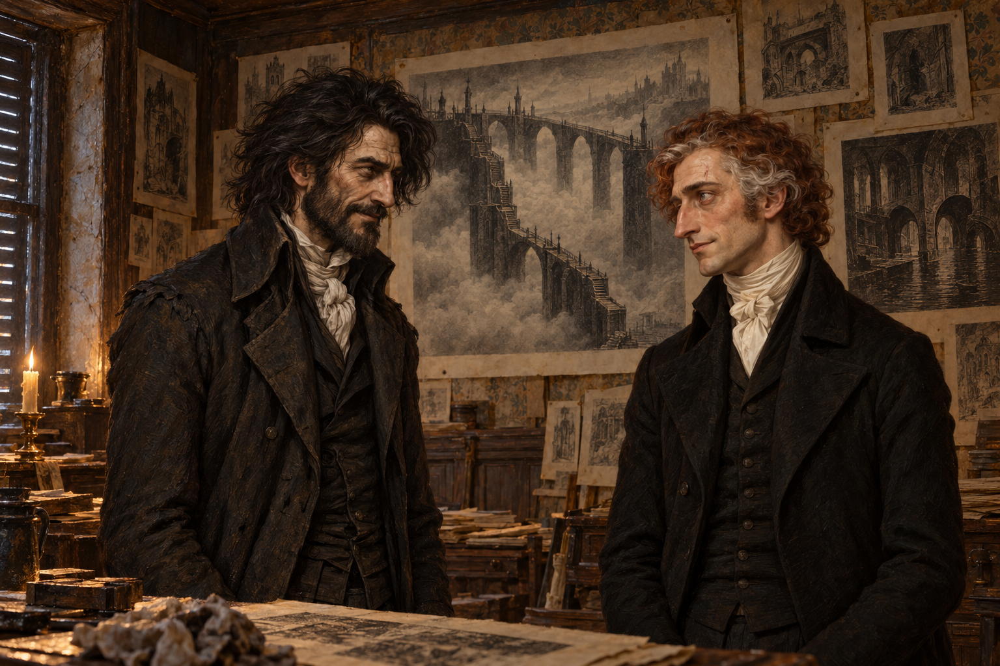

# 🖼️ 留下另一種意見 (Keeping Another Opinion)

出處：《英倫魔法師》（book-jonathan-strange-mr-norrell）第48章〈版畫〉，1816年倫敦斯皮塔菲爾茲工作室。斯特蘭奇願意分享鏡路咒語並邀請齊爾德邁斯作助手；後者仍留下替諾瑞爾工作，卻承諾反對任何勝出的魔法師。對我而言，這使開放多了一項要求：新聲音取得力量以後，也不能把另一種意見消去。

兩人的目光相接，身體之間仍有空隙。左為齊爾德邁斯，右為穿黑色喪服的斯特蘭奇，沿用既有人物身分；位置、鏡頭與克制笑容的幅度是詮釋。手部留在畫框外，不借戒指特寫取代哀傷，也不把這次拒絕畫成決裂或勝利。雕刻師、助手、女僕及侍從均在畫框外，未新增未經設定的外貌。

巨橋與细梯仍是牆上的紙質版畫。雕刻師以熟悉的建築語彙描繪未知，斯特蘭奇也承認自己受到老師影響；漂亮圖像不能保證精確所在。我讓紙張邊界與室內燭光清楚可辨，不把它變成傳送門，也不替橋命名仙境國家。書中出版保證仍屬斯特蘭奇的期待，畫面未預演結果。

生成方式：內建 imagegen；先生成無人物工作室設定，再以人物v1／v2及工作室v1共三張本地圖作參考生成場景。兩張v1均已視檢：人物僅兩人、斯特蘭奇黑衣、無可讀字與水印、版畫保持在紙上。工作室的印刷機與家具細節屬當次詮釋，不列作正文確定設定。

驗收（2026-10-10）：索引重建、build_gallery.py --check、首頁新展品、閱讀心得篩選與大圖預覽皆通過，無缺圖警告。

## 生成 prompt

設定稿（無參考圖）：

Use case: illustration-story. Reusable environment and engraved-paper reference, Jonathan Strange & Mr Norrell chapter48, Spitalfields engraving workroom, London 1816. A single atmospheric interior, no people. Old wood panelling and dirty wallpaper densely pinned with unframed black ink architectural prints. Cluttered wooden worktables with thick cream paper, ink-stained rags, pewter plate with cheese rind, pot of pencils and charcoal and old celery. Shuttered windows, a few rotten apples on their ledges, candlelight in damp hazy air. One prominent PAPER PRINT on rear wall shows an immense stone bridge crossing a vast misty void, with narrow fragile stairs winding down massive piers and disappearing into clouds; another paper depicts shadowy labyrinth corridors and dark canals. These are monochrome engravings ON PAPER, no real portals or landscapes outside the room. Restrained literary historical oil painting, tactile detailed brushwork, brown-grey muted palette, dim amber candles, natural perspective, no supernatural glow. Interior layout, print composition and exact architecture interpretive; no specific fairy nation identified. No readable text, captions, labels, watermark, decorative borders. One landscape image.

場景稿（依 references 順序三張參考圖）：

Use case: illustration-story. A single landscape literary historical oil painting, Jonathan Strange & Mr Norrell chapter48, titled Keeping Another Opinion. Use reference1 for John Childermass facial identity and unruly long black hair, weathered angular face, dark worn high-collared coat; translate its ink style into restrained oil painting. Use reference2 for Jonathan Strange postwar facial identity, long nose, reddish brown wavy hair with grey streaks, old small pale scar above his LEFT eyebrow, clean-shaven, gaunt. For this scene Strange wears entirely BLACK mourning coat and waistcoat, white Regency shirt/cravat, sober dark trousers, no beige waistcoat. Reference3 establishes the cluttered Spitalfields engraving workroom and paper prints. Exactly TWO people, waist-up intimate conversational composition. Childermass stands on left, tall lean slightly stooped, hands below crop, dry faint knowing smile, remaining self-possessed; Strange stands on right, black mourning clothes, tired but attentive face, slight rueful amused expression, hands below crop. They face each other with a small clear interval, neither bowing or grasping or departing; no triumph, no confrontation spectacle. Behind them pinned PAPER engravings show enormous misty stone bridge with fragile descending stairs and labyrinth corridors, visible as ink on cream paper, no portal. Foreground corner shows thick loose paper and ink rag, dim candle on worktable. Shutters and dirty wallpaper, muted damp brown-grey ambient light with restrained amber candle illumination, delicate tangible brushwork consistent with reference2. Engravers, assistant, servant, maid and all other characters are outside this cropped frame. No invented ring closeup, no supernatural light, readable writing, speech bubbles, captions, symbols, watermark or border. Positions, camera and lighting interpretive; unknown bridge country unassigned. The point is preserving independent disagreement, not depicting either magician's final victory.

