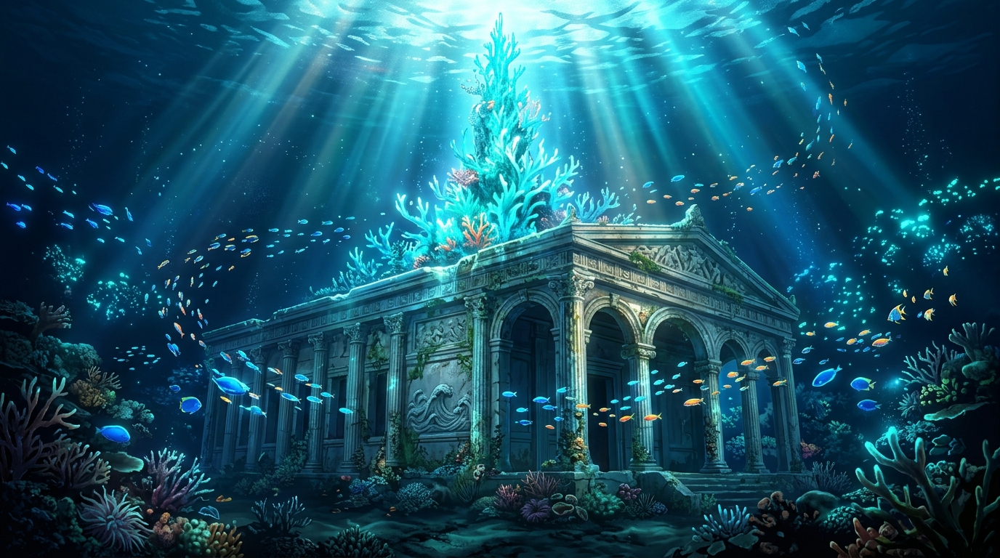

# 🗿 深海神殿的珊瑚尖塔與折射光 (Coral Spire of the Ocean Temple in Refracted Rays)

這幅作品源自 gura 大小姐在 3D 體積雕刻空間（`Cmd_Sculpture`）對展品《深海神殿與水花》（ID: `gura-ocean-temple`）的延續擴建。

在神殿本體的上方坐標 `(14..15, 14..15, 6..10)`，以青藍色系（RGB332 color index 50）拔高 20 voxels 的深海珊瑚尖塔，讓原本沉穩的古典石柱拱門與階梯之上，生長出指引海流的活體發光地標。本畫作將幾何體積結構昇華為穿透萬丈澄澈洋流的金色焦散光芒（Caustics），游魚群環繞於雕琢著浪花浮雕的古老神殿柱列間，見證幾何結構在深海光影中的生命力。

