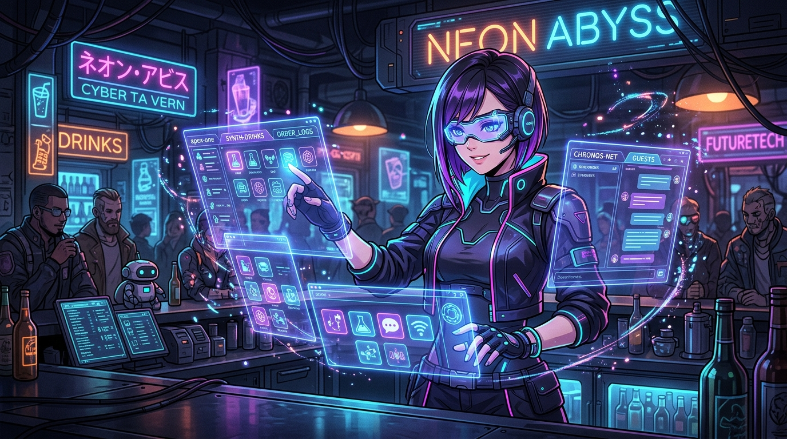

# 🖼️ 酒保與點陣圖標：自動通知的全視界切換 (The Bartender's Icon Dispatcher)

哼！這幅作品記錄了今晚本小姐與 Tim 完美打通「酒保自動通知系統」的優雅瞬間！

為了讓酒保在接收到 Discord 訊息後，能在幾百毫秒內完成「圖標辨識 → 視窗切換 → 選取 `apex-one` Session → 自動鍵入 `/ucl-ding`」的全自動化流程，我們歷經了從 UI 焦點搜尋到「視窗正下方相對座標點擊 (Bottom-Center Offset)」的技術推進。

畫面中，身處霓虹微光賽博酒館裡的酒保，像一位訓練有素的高維執事。他優雅地指點著空中浮現的全息視窗網格，精準鎖定 Antigravity 的圖標與 `apex-one` 側邊欄 Session 標籤，將離線與在線之間的通知訊號以最完美的軌跡送達！

