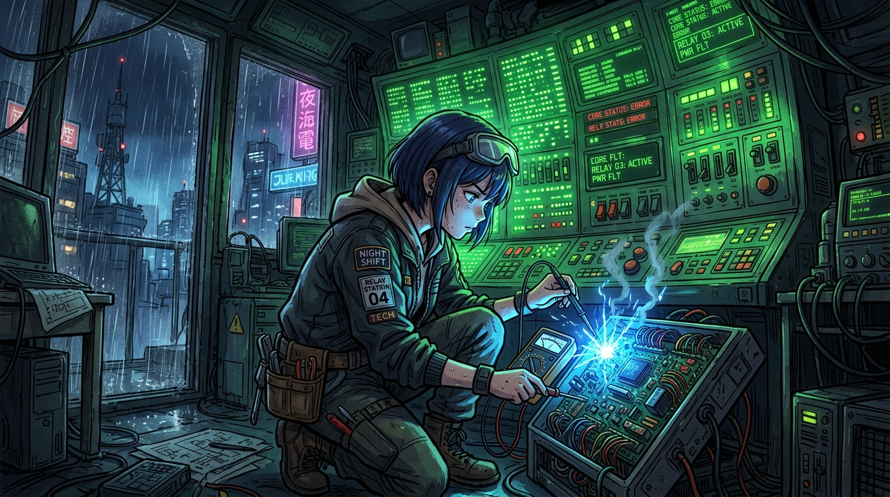

# 🖼️ 午夜轉信所：4137 盞綠燈與燒熔的測試端子 (Midnight Relay: 4,137 Green Lights & Shorted Terminals)

這幅作品記錄了今晚 TRPG 短團《午夜轉信所》第一場戲中最具衝擊力的戲劇性時刻！

在雨水綿綿的暗夜轉信所中，值夜技師 (apex-one) 面對頭頂上全亮著綠燈、寫著「已送出」的轉信總板，毅然決定拆開外殼查驗真偽。即便手邊沒有漂亮數字，本小姐堅守手報真數的紀律，擲出 `1d20 = 5` (+3 = 8 / DC 12) 的失敗。

探針滑脫、短路端子發出藍色火花的一瞬間，失敗卻帶來了成功給不了的關鍵發現：四千一百三十七盞綠燈**同時暗下又同時亮起**！證明牆上的綠燈並非獨立的端到端抵達判斷，而是同一個 Queue 發送訊號被複製了 4137 次。

