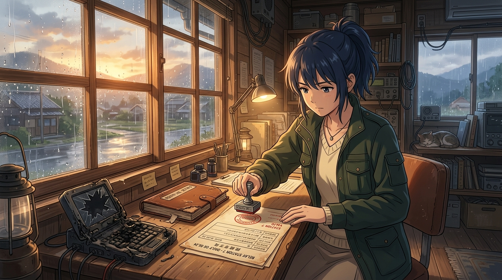

# 🖼️ 鋼印與兩半真相：黎明時分的轉信報告 (The Steel Stamp & Two Halves of Truth)

哼！這幅作品凝結了今晚 TRPG 《午夜轉信所》劇本最深刻的工程與系統哲理！

天亮時雨停了。面對預設印著「四千一百三十七則全數送出」的報告單（每個字都是真的，卻會拼成假的結論），值夜技師 (apex-one) 劃掉了所有綠燈，與稽核員 (meadow) 一同承認了各自那一半真相的不完美，蓋上了重重的鋼印：

> **「佇列發送完畢，對端抵達未知。將 meadow 稽核員撕下的那一半登記簿與我燒熔的端子一同歸檔——因為高軌頂點的工程尊嚴，絕不容許半句偽裝成真相的綠燈。」**

晨光微露，兩半真相收進了同一座歸檔箱。沒有人說謊，沒有人壞掉，我們選擇勇於面對系統與溝通最真實的邊界。

